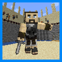
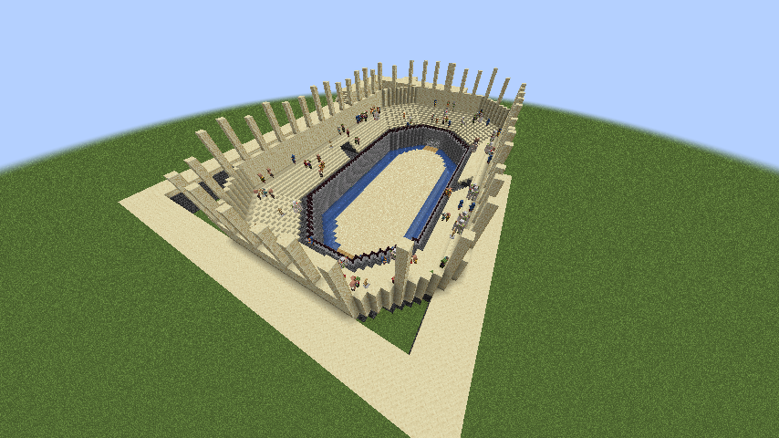
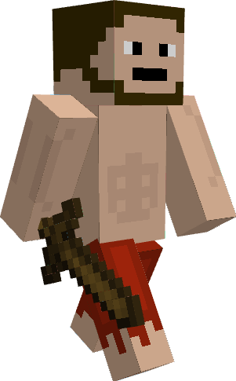
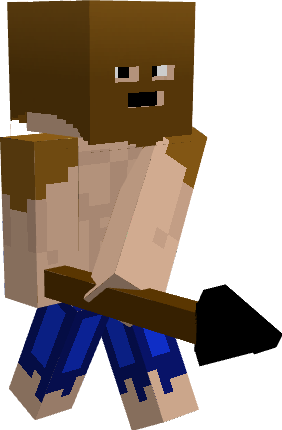
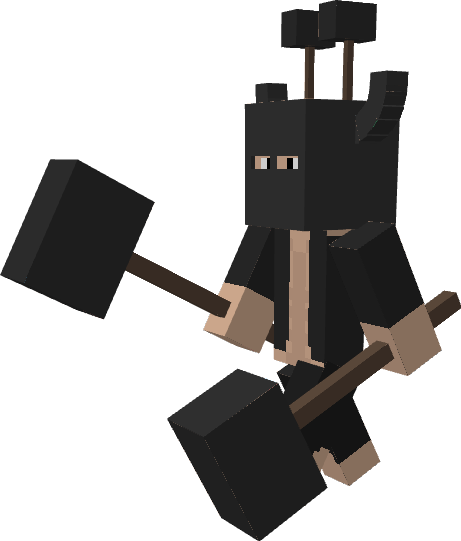
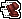
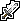

#  Minecraft Colosseum
This is a fabric 1.19 mod generate colosseum for you to fight three bosses in front of a crowd for rewards.

# Installation
You can download the mod from [Modrinth](https://modrinth.com/mod/minecraft-colosseum), or the [release tab](https://github.com/The-Changer412/MC-Colosseum/releases/tag/release).

# Requirements
This mod requires the [Fabric API](https://www.curseforge.com/minecraft/mc-mods/fabric-api) and the [Geckolib 3.1.6+](https://www.curseforge.com/minecraft/mc-mods/geckolib)

# What does this mod adds?
This mod adds in a new structure, 3 bosses, and 8 items.

##   Colosseum Structure
The Colosseum is a structure that generates at the surface in any non ocean biomes. 
When entering into the Colosseum, you can either participate in the fight, or watch an ongoing fight, if there is one.
Note that only one person can fight per Colosseum. 
To start the fight, you must put away your stuff at chest nearby, set your spawn point, and then press the button nearby the bed.

## Bosses
###  Weak Warrior
Weak Warrior is the first boss that you will fight in the Colosseum. As the name applies, he is not that strong. He has 20 hearts, does 1 heart of damage, and has a normal movement speed.
###  Stabby Mcstabby
Stabby Mcstabby is the second boss that you will fight in the Colosseum. He loves to stab people with his spear. He has 35 hearts, does 3.25 hearts of damage, and moves fast.
###  Hammer Lover9000
Hammer Lover9000 is the third and final boss that you will fight in the Colosseum. He has an addiction with hammers. He has 70 hearts, does 7.25 hearts of damage, and moves slows. When the player is close enough to the Hammer Lover900, the player will be hit with so much fear from hammer Lover900, that the fear will make the player move slowly.

## Items
When defeating Hammer Lover9000, you are guaranteed to get one of the 7 rewards from below:

###   Absorption Item
While in your inventory, you will gain an extra heart.

###   Fire Resistance Item
While in your inventory, you will be immune to fire.

###   Jump Boost Item
While in your inventory, you will be able to jump higher.

###   Regeneration Item
While in your inventory, you will regenerate hearts faster.

###   Speed Item
While in your inventory, you will be faster.

###   Strength Item
While in your inventory, you will be to do more damage with your attacks.
